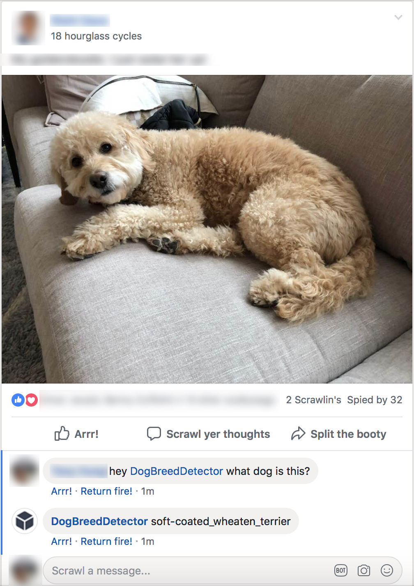
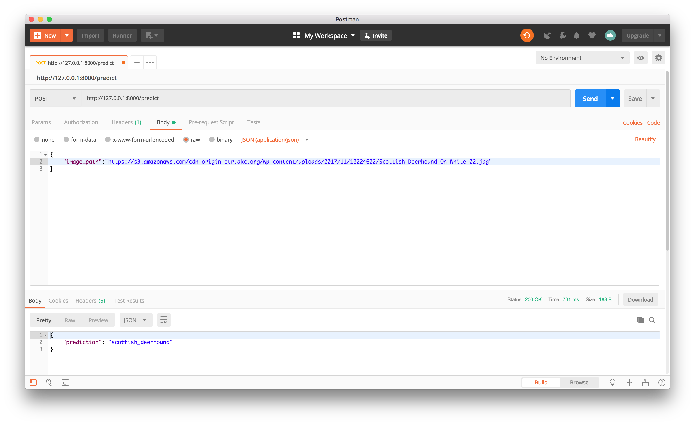
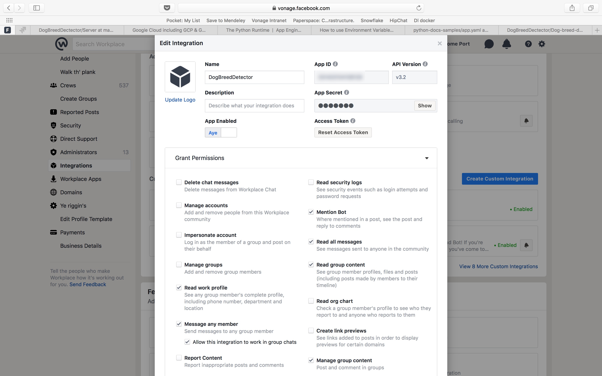
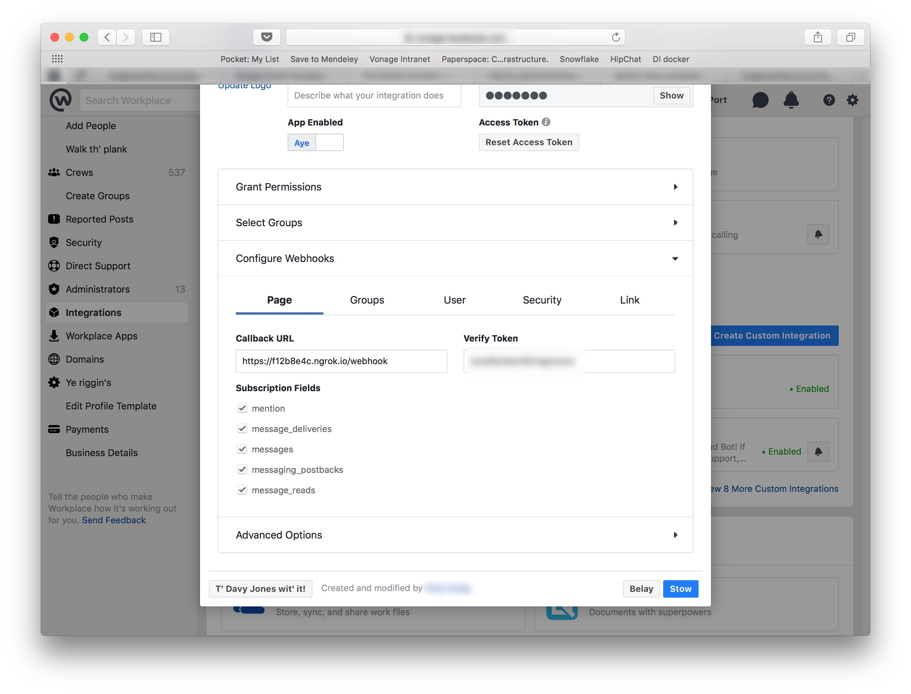
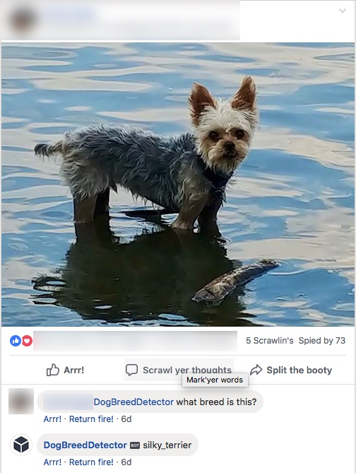

# Building a Dog Breed Detector Bot on Facebook Workplace, with Keras



Here, at Vonage, we use Facebook Workplace as one of our many channels for communication. If you haven't used it or heard about it, it's just like regular Facebook, but for companies and teams. All of us here at Vonage have an account, and we are able to view and join different groups throughout the organization.

A few months ago, one of our coworkers created a group for showing our pets, and it was a great idea, and a lot of members on the team post photos of their pets. I check the group almost everyday, and its a good way to enjoy the finer things in life (puppies!)


So after looking at everyone's photo of their dog, cat, and even bunny, some people asked, "What breed is that?". Once I saw that, i had an idea, to build a machine learning algorithm to figure out what dog breed was in the photo. And since we were all using Workplace, it made sense to build a bot that allowed any user in a post, to '@' the bot and ask what dog breed was in the photo.


### Where do I start?

In order to tackle many machine learning problems, you need data, and lots of it. Specifically, we need photos of a lot of dogs, and what kind of breed there are. That seems like a big undertaking right there. How are we going to find images of every dog breed? We *could* do this by hand: finding a bunch of images of dogs on Google, then label every photo of what kind of dog this is. Luckly, we don't have to do this. This is called Reinforcement Learning, where we training a model on images with labels (This is a image of a shitsu, this other image is a Bulldog etc..)
Lucklly, we won't have to get this data ourselves. Places like [Kaggle](https://kaggle.com), [Google Datasets](https://toolbox.google.com/datasetsearch) and  the [UCI Machine Learning Repository](http://archive.ics.uci.edu/ml/index.php) already have this kind of data. And for this example, we are going to use the dataset from the [Dog Breed Identification Challenge](https://www.kaggle.com/c/dog-breed-identification) on Kaggle

This dataset contains over 10,000 images of dogs, categorized by breed. Even though 10k *seems* like alot of images, its not. Machine learning models that have been trained well use way more images than that, so we need to be sure we can train our model well, even with this low amount of images.

### Enough chat, lets build.
We'll be splitting this post into 3 sections
* [Training the model
* Serving the model
* Building the Workplace bot


## Training the Model

### Prerequies
First, lets start with building the model. I'll be using [Google Colab](https://colab.research.google.com/) to build my [Jupyter Notebook](jupyter.org/), in Python. A Jupyter Notebook is a open sourced web app that lets you write code, as well as text and images. Its a great way to get started. Google Colab is a free service that will host your notebooks. Also, you can run your code using GPU's and [TPU's](https://cloud.google.com/blog/products/gcp/an-in-depth-look-at-googles-first-tensor-processing-unit-tpu). Running most machine learning algorithms on a GPU/TPU makes training much faster, since GPU's/TPU's are better suited for matrix operations
 
 Note: If you just want to see how the model is built, you can view my notebook [here](https://colab.research.google.com/drive/1Y1hPUXaOAhSJv93rvXZ6p27tbBUvn0zN)

 Before building the model, we need to get the data, which is hosted on Kaggle. To load the data, we need to use a package to download the data to our notebook, using the [Kaggle API](https://github.com/Kaggle/kaggle-api).
 This will allow us to download the dataset for the Dog Breed Competition. Before we can download the dataset, we need to create an account on Kaggle, and get your Kaggle API key and secret. 

 
 Go to "Create New API Token", and save the file to your machine.
 Then

 To download the data, we'll run this [cell](https://colab.research.google.com/drive/1Y1hPUXaOAhSJv93rvXZ6p27tbBUvn0zN#scrollTo=AbUjzDJBYVLq&line=24&uniqifier=1)
 ```python
 # Run this cell and select the kaggle.json file downloaded
# from the Kaggle account settings page.
from google.colab import files
files.upload()
# Let's make sure the kaggle.json file is present.
!ls -lha kaggle.json
# Next, install the Kaggle API client.
!pip install -q kaggle

# The Kaggle API client expects this file to be in ~/.kaggle,
# so move it there.
!mkdir -p ~/.kaggle
!cp kaggle.json ~/.kaggle/

# This permissions change avoids a warning on Kaggle tool startup.
!chmod 600 ~/.kaggle/kaggle.json

#download the dataset for the dog-breed identification challenge https://www.kaggle.com/c/dog-breed-identification
!kaggle competitions download -c dog-breed-identification

#unzip the downloaded files
!unzip labels.csv.zip
!unzip test.zip
!unzip train.zip
```
When you run this cell, it will prompt to enter a file. Find the JSON file that was downloaded from Kaggle, and upload to the cell. You will then be able to run the Kaggle API and download the dataset into the notebook. The dataset contains the following:
*Training Images.
*Test Images.
*CSV containing the breed name and the filename, which points to the image in the training folder.

Now, we can load our data into a Dataframe, using Pandas, which is another python package that allows you to easily load [DataFrames](https://www.tutorialspoint.com/python_pandas/python_pandas_dataframe.htm), which is a simple data structure that contains rows and columns, kind of like a CSV. 

[Source](https://colab.research.google.com/drive/1Y1hPUXaOAhSJv93rvXZ6p27tbBUvn0zN#scrollTo=k59JDzJ-Ysl-&line=8&uniqifier=1)
```python
#import the neccesary packages
import pandas as pd
import numpy as np

#constants
num_classes = 12 # the number of breeds we want to classify
seed = 42 # makes the random numbers in numpy predictable
im_size = 299 # This size of the images
batch_size = 32

#read the csv into a dataframe, group the breeds and 
df = pd.read_csv('labels.csv')
selected_breed_list = list(df.groupby('breed').count().sort_values(by='id', ascending=False).head(num_classes).index)
df = df[df['breed'].isin(selected_breed_list)]
df['filename'] = df.apply(lambda x: ('train/' + x['id'] + '.jpg'), axis=1)


breeds = pd.Series(df['breed'])
print("total number of breeds to classify",len(breeds.unique()))

df.head()
```

This prints out the first 10 rows in the dataset that we created. 


Note, for this training, we are only going to train the 12 most popular breeds. The reason for this is because training for all the breeds(120), takes up a lot of memory, which actually crashes Google Colab. In order to get around this, I've trained the same model on a Google Cloud instance. Check out https://towardsdatascience.com/running-jupyter-notebook-in-google-cloud-platform-in-15-min-61e16da34d52 for more info


Next, we need to write a function that will resize all the images to the size we need, which is 299x299px. It will be clear *why* we need to resize the image later

[Source](https://colab.research.google.com/drive/1Y1hPUXaOAhSJv93rvXZ6p27tbBUvn0zN#scrollTo=LuG1lYfswAtO)
```python
from keras.preprocessing import image

def read_img(img_id, train_or_test, size):
    """Read and resize image.
    # Arguments
        img_id: string
        train_or_test: string 'train' or 'test'.
        size: resize the original image.
    # Returns
        Image as numpy array.
    """
    path =  train_or_test + "/" + img_id + ".jpg"
    img = image.load_img(path, target_size=size)
    return image.img_to_array(img)
```

This uses a function inside Keras to load the image at the size we need(299x299) and converts it to a multi-dimensional numpy array (matrix)

Next, we need to convert the labels("basenji", "scottish_deerhound") into vectors, since our machine learning model can only deal with numbers. To do this, we'll use Scikit-Learn's [LabelEncoder](https://scikit-learn.org/stable/modules/generated/sklearn.preprocessing.LabelEncoder.html)

Then we'll split the dataset into 2 vectors, one for training and the other for testing. When we train our model, we'll use the data from the training set to train the model, then when we need to see how well it did, we'll test the model on the test set

[Source](https://colab.research.google.com/drive/1Y1hPUXaOAhSJv93rvXZ6p27tbBUvn0zN#scrollTo=Oc74pGmVvQKx)
```python
from sklearn.preprocessing import LabelEncoder
label_enc = LabelEncoder()
np.random.seed(seed=seed)
rnd = np.random.random(len(df))
train_idx = rnd < 0.9
valid_idx = rnd >= 0.9
y_train = label_enc.fit_transform(df["breed"].values)
ytr = y_train[train_idx]
yv = y_train[valid_idx]
```

Finally, we'll take all the images in the training set, and resize them using the `read_img` function. Then we need to process each image to put it in the correct format that our Model is expecting using [xception.preprocess_input](https://stackoverflow.com/a/47556342/457901)

[Source](https://colab.research.google.com/drive/1Y1hPUXaOAhSJv93rvXZ6p27tbBUvn0zN#scrollTo=Oc74pGmVvQKx&line=9&uniqifier=1)
```python
from sklearn.preprocessing import LabelEncoder
label_enc = LabelEncoder()
np.random.seed(seed=seed)
rnd = np.random.random(len(df))
train_idx = rnd < 0.9
valid_idx = rnd >= 0.9
y_train = label_enc.fit_transform(df["breed"].values)
ytr = y_train[train_idx]
yv = y_train[valid_idx]
```

[Source](https://colab.research.google.com/drive/1Y1hPUXaOAhSJv93rvXZ6p27tbBUvn0zN#scrollTo=pu1lsrkVu336&line=10&uniqifier=1)
```python
from tqdm import tqdm
from keras.applications import xception

x_train = np.zeros((train_idx.sum(), im_size, im_size, 3), dtype='float32')
x_valid = np.zeros((valid_idx.sum(), im_size, im_size, 3), dtype='float32')
train_i = 0
valid_i = 0
for i, img_id in tqdm(enumerate(df['id'])):
    img = read_img(img_id, 'train', (im_size, im_size))
    x = xception.preprocess_input(np.expand_dims(img.copy(), axis=0))
    if train_idx[i]:
        x_train[train_i] = x
        train_i += 1
    elif valid_idx[i]:
        x_valid[valid_i] = x
        valid_i += 1
print('Train Images shape: {} size: {:,}'.format(x_train.shape, x_train.size))

[00:06, 201.73it/s]Train Images shape: (1218, 299, 299, 3) size: 326,671,254
```

Lets go over what `xception.preprocess_input` is. For our model to get good results, we can't just give it all the images, and expect our model to learn. We don't have enough images and the patience to train this. It would like lots of images and lots of compute time to train. Luckily, we can use [Transfer Learning](https://blog.keras.io/building-powerful-image-classification-models-using-very-little-data.html). For Transfer learning, we can use the features from a model that has been previously trained on another dataset, like [Imagenet](www.image-net.org/) and use this for our training.


source: https://medium.com/@14prakash/transfer-learning-using-keras-d804b2e04ef8

From the photo, you can see that `Edges`, `Shapes` and `High Level features` have been already trained using lots of images, and compute time. What we will do is use all these layers, except for the `Classifiers`. We will then add our own layers to train on, using the images from our dataset

For our model, we'll be using [Xception](https://keras.io/applications/#xception) as our base model. In my experiments, i've seen that this model gives us really good results. For any other datasets, there may be other models that are more suited to your needs for better results.

Even though we have a base model (Xception) as our starting point, we still don't have enough images to train with. So we need do generate new images. We can do this by zooming and rotating the images that we have, so that model will have more images that are similar, but not the same as the images we already have. In Keras, we can use an [ImageDataGenerator](https://keras.io/preprocessing/image/) to take a batch of images at a time, and modify the images we already have

//TODO: show images of image gen


Now, we can build our model. 
Since we are using Xception as our base model, our custom model is very simple. For our model, we'll load the output from Exception, which is all the layers that have already been traned on images.
Then build a Sequential model. From the Keras blog:

"The Sequential model is a linear stack of layers." - [Getting started with the Keras Sequential model](https://keras.io/getting-started/sequential-model-guide/)

All this means is that we can stack other layers on top of our existing model. 

Here's our model.

[Source](https://colab.research.google.com/drive/1Y1hPUXaOAhSJv93rvXZ6p27tbBUvn0zN#scrollTo=JwMbMjeowaPi&line=25&uniqifier=1)

```python
from keras.layers import GlobalAveragePooling2D, Dense, BatchNormalization, Dropout
from keras.optimizers import Adam, SGD, RMSprop
from keras.models import Model, Input

# create the base pre-trained model
base_model = xception.Xception(weights='imagenet', include_top=False)
# first: train only the top layers (which were randomly initialized)
# i.e. freeze all convolutional Xception layers
for layer in base_model.layers:
    layer.trainable = False

# add a global spatial average pooling layer
x = base_model.output
x = BatchNormalization()(x)
x = GlobalAveragePooling2D()(x)
# let's add a fully-connected layer
x = Dropout(0.5)(x)
x = Dense(1024, activation='relu')(x)
x = Dropout(0.5)(x)
# and a logistic layer and set it to the number of breeds we want to classify, 
predictions = Dense(num_classes, activation='softmax')(x)

# this is the model we will train
model = Model(inputs=base_model.input, outputs=predictions)
```

First we take our `base_model`, which is Xception, then, `Freeze` the layers. This means that we won't do any training on those layers, since they have already been trained. 
Next, we'll take the output from the `base_model` and add
* [BatchNormalization](https://keras.io/layers/normalization/)  - applies a transformation that maintains the mean activation close to 0 and the activation standard deviation close to 1.
* [GlobalAveragePooling2D](https://keras.io/layers/pooling/) layer  - reduces the number of parameters to learn
* [Dropout](https://keras.io/layers/core/#dropout) - randomly turns off inputs to prevent overfitting
* [Dense](https://keras.io/layers/core/#dense) layer - which connects every neuron in the network
* followed by another [Dropout](https://keras.io/layers/core/#dropout) layer
* Finally, we create another [Dense](https://keras.io/layers/core/#dense) layer, and set it to the number of breeds we are training for.

For building of this model, this isn't a one model to fit all. It takes trial and error to figure out what works best for your dataset.

Now, we can train.
The way I am training my model is very basic. You'll see this type of code when going through other models in Keras.

[Source](https://colab.research.google.com/drive/1Y1hPUXaOAhSJv93rvXZ6p27tbBUvn0zN#scrollTo=qZoxr57wwoCw&line=9&uniqifier=1)
```python
import datetime
from keras.callbacks import EarlyStopping, ModelCheckpoint

epochs = 1
learning_rate = 0.001

# checkpoints
early_stopping = EarlyStopping(monitor='val_acc', patience=5)
STAMP = "{}_dog_breed_model".format(datetime.date.today().strftime("%Y-%m-%d"))

bst_model_path = "{}.h5".format(STAMP)
model_checkpoint = ModelCheckpoint(bst_model_path,
                                   save_best_only=True,
                                   save_weights_only=False,
                                  verbose=1)
# compile the model
optimizer = RMSprop(lr=learning_rate, rho=0.9)
model.compile(optimizer=optimizer,
              loss='sparse_categorical_crossentropy',
              metrics=["accuracy"])

hist = model.fit_generator(train_generator,
                           steps_per_epoch=train_idx.sum() // batch_size,
                           epochs=epochs, callbacks=[early_stopping, model_checkpoint],
                           validation_data=valid_generator,
                           validation_steps=valid_idx.sum() // batch_size)

model.save(bst_model_path)
print("Saved model to disk")
```

We first add some [callbacks](https://keras.io/callbacks/), these are simply functions that we run after each round of training, also called a `epoch`. We have 2 callback, `early_stopping` and `model_checkpoint`, `early_stopping` will stop training if the model does not improve after a certain amount of time, using the `patience` parameter of 5 means that we'll stop training if the model does not improve for 5 epochs. The `model_checkpoint` function saves the model to a file

Next we set the optimizer to [RMSprop](https://keras.io/optimizers/#rmsprop). Keras supports many optimizer, and in my experiments, RMSProp seemed to work best. An optimizer is how the model 'learns'. For each epoch, the model calculates the loss function, which is how well the model did, as compared the test set. The goal is to make this loss as low as possible, which is called [Gradient Decent](https://blog.paperspace.com/intro-to-optimization-in-deep-learning-gradient-descent/). RMSProp is one of the many algorithms that performs Gradient Decent

Next we'll build the model using `model.compile`, which accepts the optimizer, what loss function we want to calculate([sparse_categorical_crossentropy](https://keras.io/losses/)), and setting the `metrics` parameter to `accuracy`, which will tell us how accurate the model is after each epoch

After that, we'll do our training by calling `model.fit_generator`. This function takes the `ImageDataGenerator`s for both our training and test set, how many steps we will run, number of epochs, what to validate on, and the number of steps to validate.

We'll train this model for 10 epoch's for now, just to see how we did. Remember, we are only training on 12 breeds


```
Epoch 1/10
38/38 [==============================] - 40s 1s/step - loss: 0.5477 - acc: 0.8281 - val_loss: 0.0555 - val_acc: 0.9766

*skipping output for readability*

Epoch 00009: val_loss did not improve from 0.01133
Epoch 10/10
38/38 [==============================] - 33s 857ms/step - loss: 0.2426 - acc: 0.9358 - val_loss: 0.0457 - val_acc: 0.9905

Epoch 00010: val_loss did not improve from 0.01133
Saved model to disk
```
So, we have a model that is 82% accurate when predicting 12 breeds. 
When we run this model on all the breeds on a Google Cloud Instance, 
When we run this on a GCP , we get 85% accuracy when classifing 120 breeds on 10 epochs. Note each epoch when training 120 classes took about 1 hour each.
```
Epoch 1/1
288/288 [==============================] - 4362s 15s/step - loss: 1.0910 - acc: 0.7418 - val_loss: 0.4133 - val_acc: 0.8594
```

The fully training model is [here](https://s3.amazonaws.com/dog-breed-dectector-models/2018-11-21_dog_breed_model.h5). To load the model, just use `keras.models.load_model({path to hd5 model})`
like so:
```python
from keras.models import load_model
model = load_model('2018-11-21_dog_breed_model.h5')
```
### Make predictions

Now that we have a model, we need to use it. We'll write a function that takes an image from the internet, format it to what the model expects(299x299 image) and make the prediction using `model.predict()`. This function takes in a image, which is converted into a numpy array, and returns a list of probabilities for each breed. We use `np.argmax()` to find the index of the highest probability from the output of `model.predict()`. To return the name of the breed, we use the `lables.csv` that we used earlier, which contains all the breed names, sort the list, then return the breed name  

```python
from keras.models import load_model
from keras.preprocessing import image
import matplotlib.pyplot as plt
import numpy as np
import os


def predict_from_image(img_path):

    img = image.load_img(img_path, target_size=(299, 299))
    img_tensor = image.img_to_array(img)                    # (height, width, channels)
    img_tensor = np.expand_dims(img_tensor, axis=0)         # (1, height, width, channels), add a dimension because the model expects this shape: (batch_size, height, width, channels)
    img_tensor /= 255.                                      

    global graph
    with graph.as_default():
        pred = model.predict(img_tensor)
        predicted_class = sorted_breeds_list[np.argmax(pred)]

    return predicted_class
```
And lets see how it does when we give it a image of a Scottish Deerhound


Nice! its working well.


## Serve the model
Next, in order to serve this model, we'll need to host it on a server. We'll use the [Flask](http://flask.pocoo.org) package to make a simple API. It will have 1 route, called `/predict` that will take a path to an image, and return a JSON response with the breed name. The full code for this is on [Github](https://github.com/tbass134/DogBreedDectector/tree/master/Server)

A Flask application is very simple to startup, we first create new instance of Flask and run it
```python
app = Flask(__name__)

if __name__ == '__main__':
    app.run(debug=True, use_reloader=True)
```
Next, we'll need to load our training model. We'll also need to include the Dataframe that includes the names of all the breeds. We'll use this in order to get the breed name when the model makes the prediction.
```python
# inputs
num_classes = 120
im_size = 299

df = pd.read_csv('labels.csv')
sorted_breeds_list = sorted(list(df.groupby('breed').count().sort_values(by='id', ascending=False).head(num_classes).index))

model = load_model('2018-11-15_dog_breed_model.h5')
graph = tf.get_default_graph()
```
The `num_classes` variable is set the number of breeds we want to use. In this case, we want to use all the breeds. We've downloaded the fully trained model from [here](https://s3.amazonaws.com/dog-breed-dectector-models/2018-11-21_dog_breed_model.h5) and have loaded the model into memory. You'll notice that we created a `graph` variable which is set to `tf.get_default_graph()`, which creates a new [Tensorflow Graph](https://www.tensorflow.org/guide/graphs), which will perform all of our model computations. Next, we'll create our `/predict` route to handle the predictions. It will take a url to an image, save it, convert the image to a numpy array, from the `predict_from_image()` function we created earlier and make the prediction using `model.predict()`
```python 
@app.route('/predict', methods=['POST'])
def predict():
    try:
        json = request.json

        image_path = json['image_path']
        ts = time.gmtime()
        ts_str = time.strftime("%s", ts)
        filename = ts_str+".jpg"
        f = open(filename,'wb')
        f.write(requests.get(image_path).content)
        f.close()

        prediction = predict_from_image(filename)
        os.remove(filename)
        return jsonify({'prediction': prediction})

    except Exception as e:
        return jsonify({'error': str(e), 'trace': traceback.format_exc()})
```
To run our server locally, we'll use Gunicorn, which is a Python WSGI HTTP Server for UNIX. You'll need to install the framework via `pip`
```
pip install gunicorn
```

Next, we'll run our app in Terminal by running
```
gunicorn app:app
```
Thats it! Our sever is up and running. It defaults to our localhost(http://127.0.0.1:8000)
We can test the API using Postman


Our payload is a JSON object with one property called `image_path`, and the output is the name of the breed!

After we've tested our API, we can now deploy. For this application, i'm using [Google App Engine](https://cloud.google.com/appengine/) to deploy our application. Google has a nice quickstart on [how to install and use the gcloud command line utility](https://cloud.google.com/python/getting-started/hello-world)

After you have created a a new project on GCP, downloaded the gcloud command line utility, and initialized, you'll then deploy the application. 
First, you need to create a `app.yaml` file, which describes an application's deployment configuration.
The yaml file will look like the following

```
runtime: python
env: flex
entrypoint: gunicorn -b :$PORT main:app

runtime_config:
  python_version: 3
```
Now, we can deploy our application to gcloud using the command `gcloud app deploy`
After a few minutes, your application will be up and running on `http://YOUR_PROJECT_ID.appspot.com`

## Bulid the Workplace Bot

Our final task is to use this API in our Workplace bot. We won't go over everything on how to build a Workplace Bot, but you can view how the bot is built on [Github](https://github.com/tbass134/DogBreedDectector/tree/master/Dog-breed-detector-bot)

In order to build a Workplace bot, you'll need to have a Workplace admin account. 
On your Workplace account, go to `Admin Panel` -> `Integrations`, and create a new Integration


Copy the `App ID`, `App Secret` and `Access Token` into your Environment variables in the project.
Next, you'll need to configure the webhook and point it to your application. For now, we'll use ngrok to access our application when running locally


After you run the bot using `npm start`, you can now start using the application. 

For our bot, we'll allow users to ask the bot a question directly in the comments section of a post that contains an image. This way, we can retreive the image url, which we can send to our Flask API for the prediction. 
```nodejs
if (messagingEvent.field == "mention") {
    var message = messagingEvent.value.message.toLowerCase()
    //If any text is sent to the bot, we'll get the image url from the post,
    //make a prediction on our Flask API,
    //get the breed name,
    //and post a comment into that post with the name of the breed dectected
    exports.getPostContents(messagingEvent.value.post_id)
    .then(function (photo_url) {
        return predictions.predictBreed(photo_url)
    }).then(function (breed_name) {
        exports.addCommentAPI(messagingEvent.value.post_id, breed_name)
    }).catch(function (error) {
        exports.addCommentAPI(messagingEvent.value.post_id, "Sorry, but I'm unable to tell you what dog that is")
    })
    
}
else {
    console.log('Webhook received unknown messagingEvent: ', messagingEvent);
}
```
The full code for this is [here](https://github.com/tbass134/DogBreedDectector/blob/a299f3c8cb572b49c91638db845d904541d29ec0/Dog-breed-detector-bot/facebookInterface.js#L129)

Now that we can test it on Workplace. 



## Conculusion
After our very long post, we've shown you how to use build a dog breed classifier using Keras, train our model, expose the trainined model on a server and use this model in a Workplace Bot for Facebook. Learning how to build a machine learning is nice, but its nothing unless you allow others to use it. You need to continue to get feedback from others when they are using your model. It will help u see what is working and what doesnt. This is necessary to build great models. 
I hope this gives you the knowledge and tools on how to start building your models. I can't wait to know what you come up with!